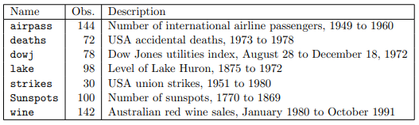

## 2021711914 김동영 
```{r,echo=T}
setwd("G:/내 드라이브/gdrive/work/연구논문/시계열스터디")
```


```{r,message=F, warning=F}
library(ggplot2)
library(dplyr)
library(magrittr)
```
데이터셋 불러오는법은 `library(itsmr)` 쓰시면 됩니다. 패키지에 들어있는 데이터목록은 다음과 같고 `data()`함수로 불러오는건 아니고 그냥 패키지에서 바로 부르는 형태입니다.



### Figure 1-1
```{r}
dat = itsmr::wine
# 1980년에 시작하여 월별 ts data로 변경
dat = ts(dat,start=c(1980,1), frequency=12) / 1000
dat # ts형태로 잘 변경된 것을 확인
plot(dat, xlab='', ylab='(thousands)')
points(dat, pch=0)
```


### Figure 1-2
```{r}
set.seed(1)
dat = sample(c(-1,1), (1995-1933+1), replace=T)
dat[sample(1:length(dat),3)] = NA
dat = ts(dat,start=1933, end=1995)
plot(dat, type='l', xlab='',ylab='', ylim=c(-2,2))
points(dat, pch=0);abline(h=0)
```

### Figure 1-3
```{r}
dat = itsmr::deaths
dat = ts(dat, start=c(1973,1), frequency=12) / 1000
plot(dat, xlab='', ylab='(thousands)')
points(dat, pch=0)
```

### Figure 1-5
```{r}
n = (1990-1790) / 10 + 1 # 21
dat = ts((1:n)^2, start=1790, end=1990, frequency=0.1)
dat = dat + rnorm(n, sd=5)
plot(dat, xlab='',ylab='(Millions)')
points(dat, pch=0)
```

### Figure 1-6
```{r}
dat = itsmr::strikes
dat = ts(dat, start=1950) / 1000
plot(dat, xlab='', ylab='(thousands)')
points(dat, pch=0)
```

### (p21) Polynomial regression - OLS
```{r}
dat = itsmr::lake
dat = ts(dat, start=1875)
x = 1875:1972
x2 = x^2
lm_fit = lm(dat ~ 1 + x + x2)
plot(dat, ylab='level in feet')
title('Lake Huron Water level')
lines(x, lm_fit$fitted.values, col='red')
```

### (p23) Estimating trend only - Smoothing
```{r}
dat = itsmr::lake
dat = data.frame(n=1:length(dat), y=dat, t=x)
head(dat)
dat %<>% 
  mutate(group = (n-1) %/% 10)


last_dat = dat %>% group_by(group) %>% 
  slice(n()) %>% 
  ungroup()

dat = last_dat %>% 
  mutate(group = group + 1) %>% 
  slice(1:9) %>% bind_rows(dat) %>% 
  arrange(group,t) %>% 
  group_by(group) %>% 
  mutate(local_mean = mean(y))

cut_point = c(1875,last_dat$t)


ggplot(data=dat)+
  geom_line(aes(x=t,y=y),color='grey')+
  geom_line(aes(x=t,y=local_mean,group=group),size=1.5)+
  geom_vline(xintercept=cut_point, linetype=2)+
  labs(x='year', y='level in feet')+
  theme_classic()
```

### (p24) Smoothing1 - Moving Average filter
```{r}
local_average = function(x,q){
  # 행렬로 짜고 싶은데 일단 for문으로 짜기
  Wt = c()
  for (i in (q+1):(100-q)){
    w = mean(x[(i-q):(i+q)])
    Wt = c(Wt,w)
  }
  Wt = c(rep(NA,q),Wt,rep(NA,q))
  return(Wt)
}

dat = itsmr::lake
dat = ts(dat, start=1875)
dat_smooth = local_average(dat,6) %>% ts(start=1875)

plot(dat, col='grey')
lines(dat_smooth, lwd=2)

# 패키지 써서 하기
plot(dat, col='grey')
dat_smooth = forecast::ma(dat, 13)
lines(dat_smooth, lwd=2)
```

### (p29) Exponential smoothing
```{r}
ex4 = itsmr::smooth.exp(dat, 0.4) %>% ts(start=1875)
plot(dat, ylab='level in feet')
lines(ex4, col='red');title('Lake Huron Water level')
```


### (p30) Weakness of Smoothing - bandwidth selection
원래는 앞뒤로 NA로 주는게 맞는데 꽉 채운 데이터 쓸려고 smooth.ma 사용
```{r}
plot(dat)
q_vec = seq(5,30,5)

for (q in q_vec){
  dat_smooth= itsmr::smooth.ma(dat, q) %>% ts(start=1875)
  lines(dat_smooth, col=q / 5 + 1, lwd=2)
}

legend('bottomleft',
       c('data',paste0('q=',q_vec)),
       col=1:6,lwd=2)
```

### (p32) Smoothing - MA Bandwidth selection
```{r}
plot(dat, ylab='level in feet')
dat_smooth = itsmr::smooth.ma(dat, q=33) %>% ts(start=1875)
lines(dat_smooth,col='red')
title('Lake Huron Water level')
```

### (p34) Estimating trend only - Differncing
```{r}
dat
y = diff(diff(dat))
plot(y, ylab='level in feet');title('After diff^2 Lake Huron Water level')
```

### (p39) Harmonic regression
```{r}
dat = itsmr::deaths %>% ts(start=c(1973,1),frequency=12)
n = length(dat)
t=1:n; f1 = 6; f2 = 12;
costerm1 = cos(f1*2*pi/n*t); sinterm1 = sin(f1*2*pi/n*t);
costerm2 = cos(f2*2*pi/n*t); sinterm2 = sin(f2*2*pi/n*t);
plot(dat)

lm_fit1 = lm(dat ~ 1 + costerm1 + sinterm1)
lm_fit2 = lm(dat ~ 1 + costerm1 + sinterm1 + costerm2 + sinterm2)

dat_season1 = lm_fit1$fitted.values %>% ts(start=c(1973,1),frequency=12)
dat_season2 = lm_fit2$fitted.values %>% ts(start=c(1973,1),frequency=12)

lines(dat_season1, col='blue')
lines(dat_season2, col='red')
legend('top',
       paste0('k=',c(1,2)),
       col=c('blue','red'),lwd=2)
```

### p(41) Seasonal smoothing
```{r}
dat = itsmr::deaths %>% ts(start=c(1973,1),frequency=12)
dat_season = matrix(dat,ncol=12,byrow=T) %>% 
  apply(2,mean) %>% rep(6) %>% 
  ts(start=c(1973,1),frequency=12)
  
plot(dat, ylab='data')
lines(dat_season, col='red')
title('US accidental deaths')
```


### (p43) Seasonal differencing
```{r}
dat = itsmr::deaths %>% ts(start=c(1973,1),frequency=12)
diff12 = diff(dat, lag=12) %>% 
  ts(start=c(1974,1), frequency=12)
par(mfrow=c(1,2))
plot(dat);plot(diff12, col='red')
```


### (p50) Accidental deaths - classical decomposition
```{r}
classical = function(data, d, order){
	n=length(data);
	# step 1
	q=ifelse(d%%2, (d-1)/2, d/2)
	x=c(rep(data[1], q), data, rep(data[n], q));
	if(d %%2 == 0){
	ff= c(.5, rep(1, 2*q-1), .5)/d;}
	if(d %%2 == 1){
	ff= rep(1, 2*q+1)/d;}
	xx = stats::filter(x, ff, method = c("convolution"))
	mhat = na.omit(xx);
	mhat = as.numeric(mhat);
	# step 2
	z = data - as.numeric(mhat);
	st = itsmr::season(z, d);
	# step 3 (regression)
	mnew = itsmr::trend(data-st, order);
	# step 4 (residuals)
	fit = mnew + st;
	resi = data - fit;
return(list(fit=fit, st=st, m=mnew, resi=resi, m1=mhat,
            z=z))
}
```
```{r}
to_ts = function(x) ts(x, start=c(1973,1),frequency=12)
dat = itsmr::deaths %>% ts(start=c(1973,1),frequency=12)
result= classical(dat, d=12, order=1)

par(mfrow=c(2,2))
plot(dat)
lines(to_ts(result$m1), col='red')
title('step1')

plot(to_ts(result$z))
lines(to_ts(result$st), col='red')
title('step2')

plot(dat)
lines(to_ts(result$m), col='red')
title('step3')

plot(dat)
lines(to_ts(result$fit), col='red')
title('Final')
```

```{r}
acf2 <- function(data, lag){
  if(missing(lag)){ lag = 35;}

  thr=qnorm(1-.05/2, mean=0, sd=1/sqrt(length(data)));

  a1 = acf(data, lag, plot = FALSE);
  x = seq(1, lag, by=1);
  y = a1$acf[-1];
  plot(x, y, type="h", xlab = "Lag", ylab="ACF");
  abline(h=0, col = "black");
  abline(h = -thr, col="blue");
  abline(h = thr, col="blue");
  title("SACF");
}
data_and_acf = function(y, lag=35, plot_title='title', line=F){
  par(mfrow=c(2,1))
  plot(y, type='l',xlab='Time')
  title(plot_title)
  if (line == T){
    lines(1:1000, 1:1000 * 0.01 - 2, col='red')
  }
  acf2(y, lag=lag)
}
```


```{r,fig.height=6}
y = rnorm(1000)
data_and_acf(y, plot_title='IID N(0,1)')
```
```{r,fig.height=6}
y = rgamma(1000, 0.5, 1)
data_and_acf(y, plot_title = 'IID Gamma(0.5,1)')
```
```{r,fig.height=6}
y = rbinom(100, 1, 1/2)
data_and_acf(y, plot_title = 'IID Gamma(0.5,1)')
```
```{r,fig.height=6}
set.seed(1)
y = rnorm(1000)
y = cumsum(y)
data_and_acf(y, plot_title = 'Random Walk')
```
```{r,fig.height=6}
y = diff(y)
data_and_acf(y, plot_title = 'Differenced')
```

```{r,fig.height=6}
y = 1:1000 * 0.01 - 2 + rnorm(1000)
data_and_acf(y, plot_title = 'Trend + Noise',line=T)
```

```{r,fig.height=6}
t = 1:length(y)
lm_fit = lm(y ~ t)
data_and_acf(y - lm_fit$fitted.values, plot_title='After linear fit')
```
```{r,fig.height=6}
n = 1000
t=1:n; f1 = 12;
costerm1 = cos(f1*2*pi/n*t);
y = costerm1 + rnorm(n)
data_and_acf(y, lag=100, plot_title='Cosine + Noise')
```


```{r,fig.height=6}
y = arima.sim(n=1000, list(ar=c(0.8)))
data_and_acf(y, lag=100, plot_title='AR(1)')
```

```{r,fig.height=6}
y = arima.sim(n=1000, list(ma=c(-0.5)))
data_and_acf(y, lag=100, plot_title='MA(1)')
```

### (p75) Test of randomness: Lake Huron
```{r}
dat = itsmr::lake %>% ts(start=1875)
t = 1:length(dat)
fitted = lm(dat ~ 1 + t + I(t^2))$fitted.values%>% 
  ts(start=1875)

plot.ts(dat)
lines(fitted, col='red')

residual = dat - fitted
plot(residual);title('residuals')
```

```{r}
itsmr::test(residual)
nortest::lillie.test(residual)
tseries::jarque.bera.test(residual)
```

